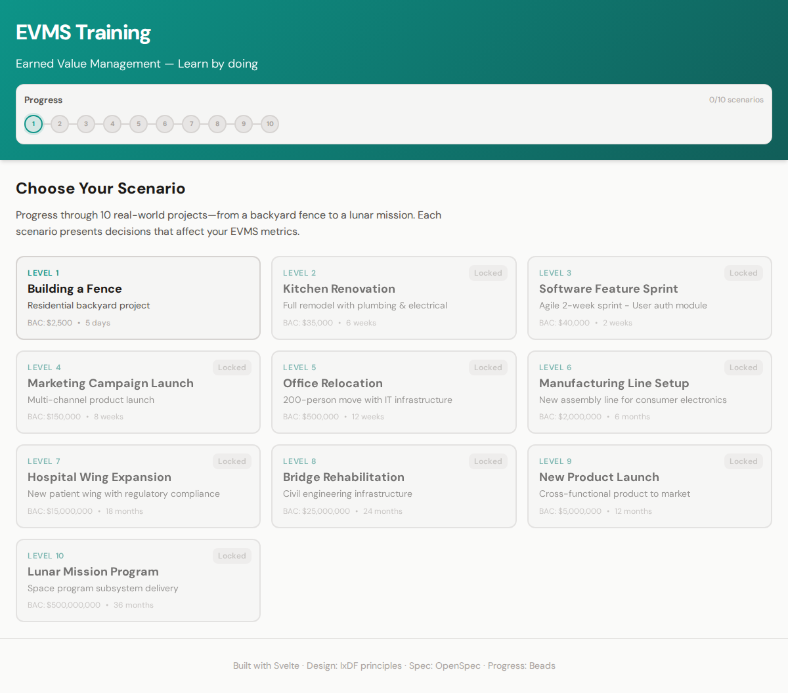
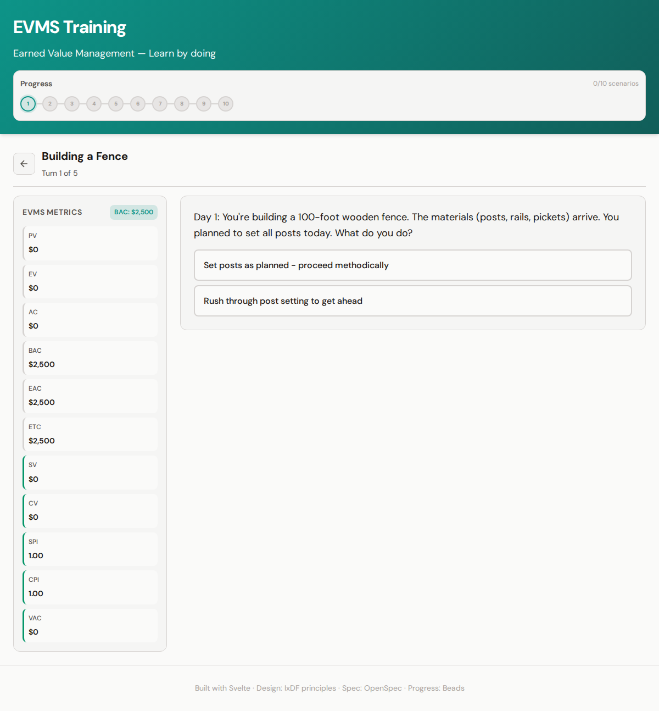
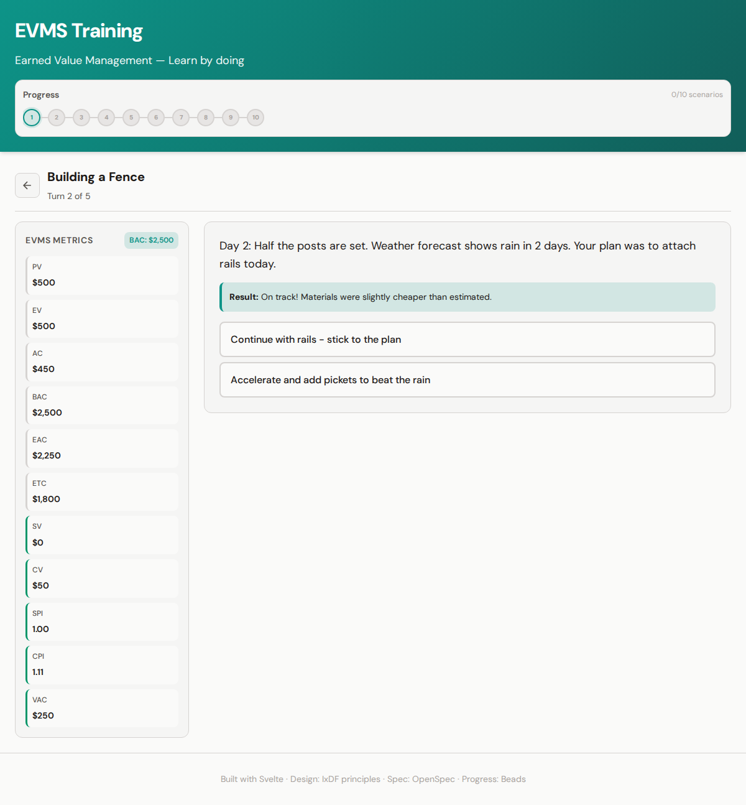
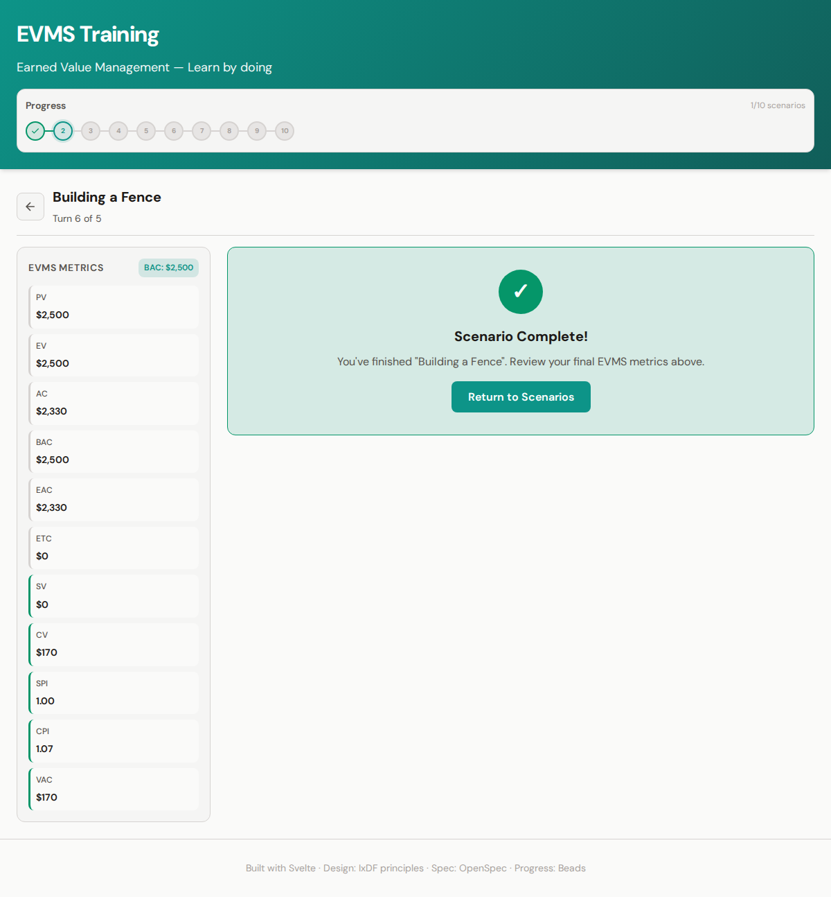
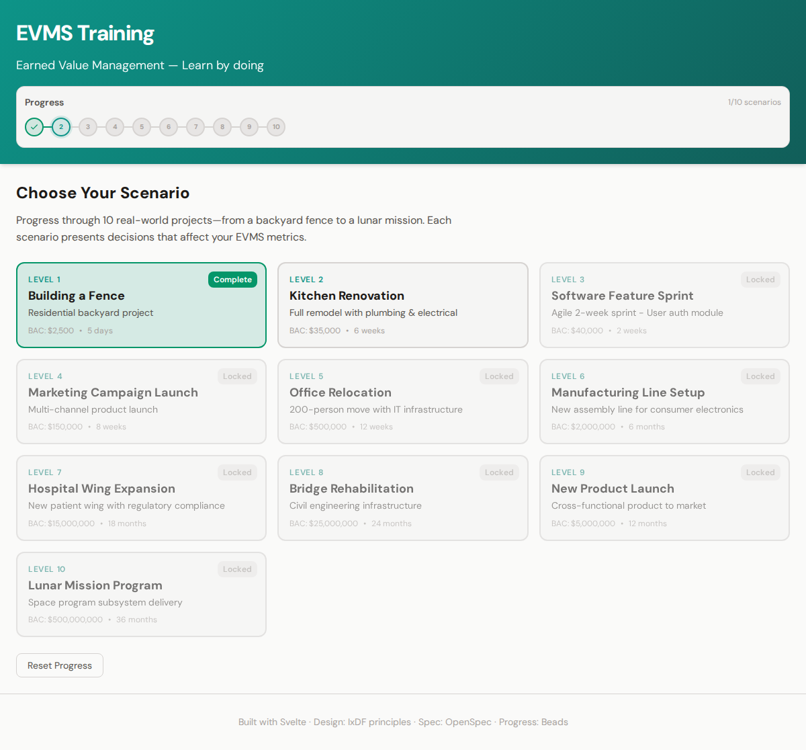

# EVMS Training - Interactive Earned Value Management Learning

An interactive web application that trains users on **Earned Value Management System (EVMS)** through 10 incrementally challenging scenarios in a choose-your-own-adventure format.

## Design & Progress Tracking

- **OpenSpec**: Design specification in `../.openspec/evms-training-website.md`
- **Beads**: Progress tracking configuration in `../.beads/evms-training-progress.json`

## Features

- **10 Real-World Scenarios** (easy → complex):
  1. Building a Fence ($2.5K, 5 days)
  2. Kitchen Renovation ($35K, 6 weeks)
  3. Software Feature Sprint ($40K, 2 weeks)
  4. Marketing Campaign Launch ($150K, 8 weeks)
  5. Office Relocation ($500K, 12 weeks)
  6. Manufacturing Line Setup ($2M, 6 months)
  7. Hospital Wing Expansion ($15M, 18 months)
  8. Bridge Rehabilitation ($25M, 24 months)
  9. New Product Launch ($5M, 12 months)
  10. Lunar Mission Program ($500M, 36 months)

- **EVMS Metrics Tracked**: PV, EV, AC, BAC, EAC, ETC, SV, CV, SPI, CPI, VAC
- **Choose Your Own Adventure**: Decision points affect project outcomes and metrics
- **Progress Persistence**: Beads-style tracking with localStorage

## How to Play

### 1. Choose a Scenario

Start on the home screen with 10 scenarios. The first scenario (Building a Fence) is unlocked; others unlock as you complete scenarios. Each card shows the project type, budget (BAC), and duration.



### 2. Read the Situation & Make Decisions

When you enter a scenario, you'll see a narrative describing a project situation. The **EVMS Metrics** panel on the left tracks PV (Planned Value), EV (Earned Value), AC (Actual Cost), and derived metrics (SPI, CPI, SV, CV). Choose one of the decision options—your choice affects how the project performs.



### 3. See the Impact

After each choice, you'll get **feedback** on the result. The metrics update immediately to reflect your decision—green indicators show good performance, red shows problems. Progress through all turns in the scenario.



### 4. Complete the Scenario

When you've made all decisions for a scenario, you'll see the **Scenario Complete!** screen. Review your final EVMS metrics, then return to the scenario list.



### 5. Progress & Unlock More

Returning to the list shows your **Progress** beads (e.g., 1/10 scenarios). Each completed scenario unlocks the next. Work through all 10—from a backyard fence to a lunar mission—to master EVMS through increasingly complex real-world situations.



---

## Tech Stack

- **Svelte 5** (runes)
- **Vite**
- **IxDF** design principles (accessibility, clarity, user-centered)

## Development

```bash
npm install
npm run dev
```

## Build (Self-Contained Static)

```bash
npm run build
```

Output in `dist/` — deploy to any static host.

## Testing

Playwright tests verify gameplay displays and functions:

```bash
npm test
# or: npx playwright test
```

To regenerate screenshots for this README:

```bash
npx playwright test tests/screenshots.spec.js --project=chromium
```
