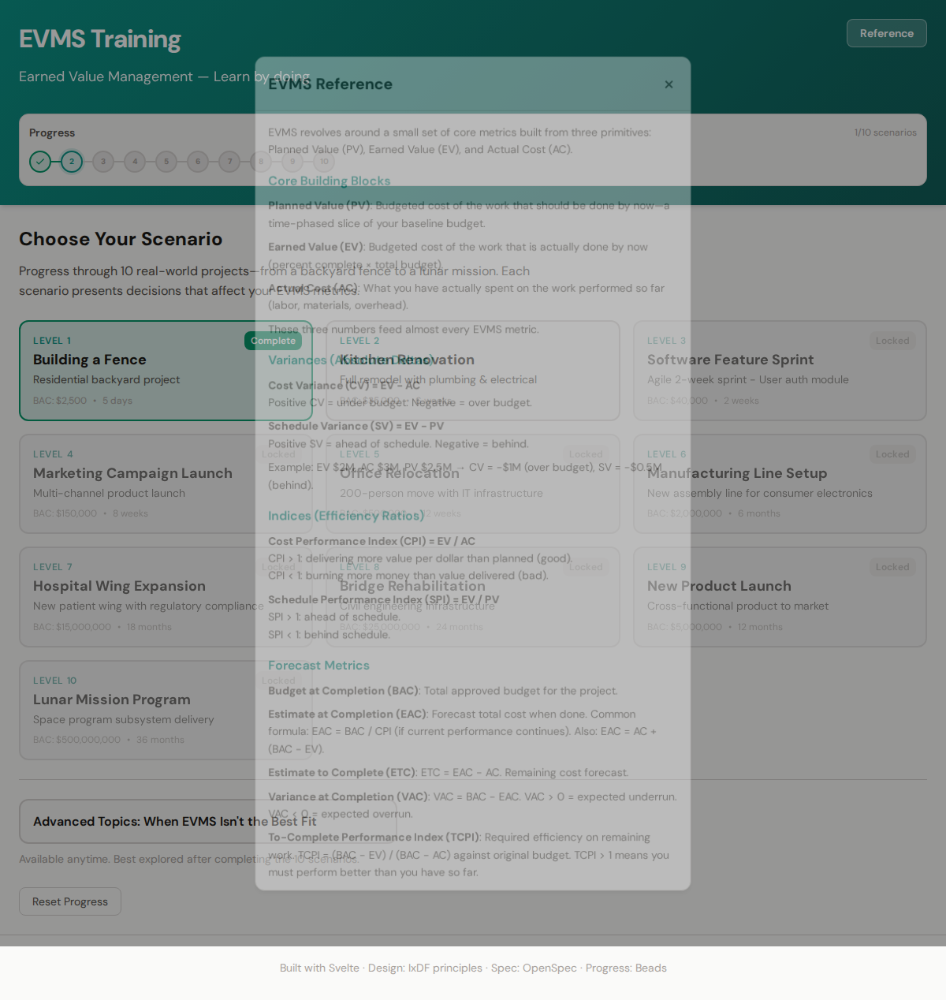
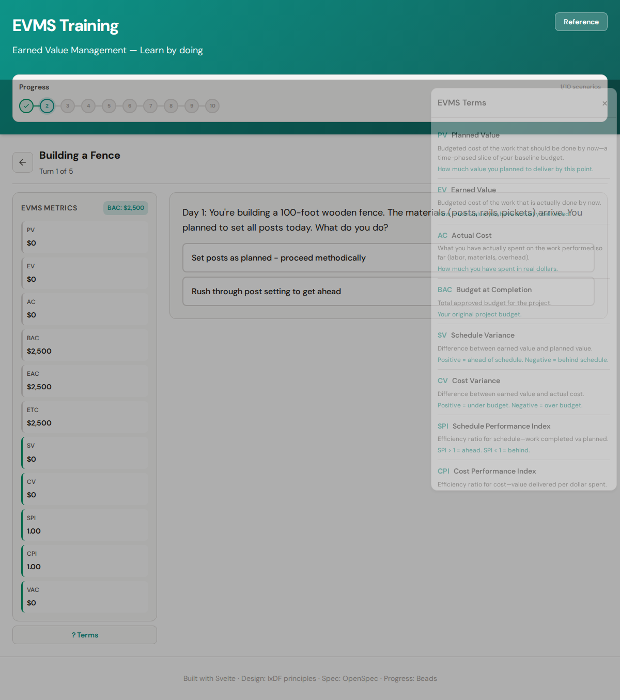

# EVMS Training - Interactive Earned Value Management Learning

An interactive web application that trains users on **Earned Value Management System (EVMS)** through 10 incrementally challenging scenarios in a choose-your-own-adventure format. Learn when and how to apply EVMS—and when to use alternatives.

## Design & Progress Tracking

- **OpenSpec**: Design specification in `../.openspec/evms-training-website.md`
- **Beads**: Progress tracking configuration in `../.beads/evms-training-progress.json`

## Features

- **10 Real-World Scenarios** (easy → complex):
  1. Building a Fence ($2.5K, 5 days)
  2. Kitchen Renovation ($35K, 6 weeks)
  3. Software Feature Sprint ($40K, 2 weeks)
  4. Marketing Campaign Launch ($150K, 8 weeks)
  5. Office Relocation ($500K, 12 weeks)
  6. Manufacturing Line Setup ($2M, 6 months)
  7. Hospital Wing Expansion ($15M, 18 months)
  8. Bridge Rehabilitation ($25M, 24 months)
  9. New Product Launch ($5M, 12 months)
  10. Lunar Mission Program ($500M, 36 months)

- **EVMS Metrics Tracked**: PV, EV, AC, BAC, EAC, ETC, SV, CV, SPI, CPI, VAC
- **Choose Your Own Adventure**: Decision points affect project outcomes and metrics
- **Progress Persistence**: Beads-style tracking with localStorage
- **Reference Section**: Full EVMS background (core blocks, variances, indices, forecast)
- **Help Toaster**: Quick EVMS terms lookup during gameplay
- **Advanced Topics**: 10 scenarios when EVMS isn't the best fit (LOE, agile, R&D, etc.) with reference links—recommended after completing the 10 core scenarios

## How to Play

### 1. Choose a Scenario

Start on the home screen with 10 scenario cards. The **Progress** beads at the top show completion (e.g., 0/10). The first scenario (Building a Fence) is unlocked; others unlock as you complete scenarios. Each card shows the project type, budget (BAC), and duration. Use the **Reference** button in the header anytime to open the EVMS background guide.


**Reference & Help**: Click **Reference** in the header for a full EVMS primer (core blocks, variances, indices, forecast metrics, and how to use them in practice). During gameplay, click **? Terms** next to the metrics panel for a slide-out glossary of PV, EV, AC, CV, SV, CPI, SPI, and more.

### 2. Read the Situation & Make Decisions

When you enter a scenario, you'll see a narrative describing a project situation—e.g., materials have arrived, weather is uncertain, or a key supplier has issues. The **EVMS Metrics** panel on the left tracks PV (Planned Value), EV (Earned Value), AC (Actual Cost), and derived metrics (SPI, CPI, SV, CV). Click **? Terms** for a quick glossary of any metric. Choose one of the decision options; your choice affects how the project performs.


### 3. See the Impact

After each choice, you'll get **feedback** explaining the result. The metrics update immediately—green borders indicate good performance (SPI/CPI ≥ 1, positive variances), red indicates problems. Use this to understand how decisions drive cost and schedule outcomes.


### 4. Complete the Scenario

When you've made all decisions for a scenario, you'll see the **Scenario Complete!** screen. Review your final EVMS metrics, then click **Return to Scenarios** to continue.


### 5. Progress & Unlock More

Returning to the list shows updated **Progress** beads (e.g., 1/10 scenarios). Each completed scenario unlocks the next. Work through all 10—from a backyard fence to a lunar mission—to master EVMS through increasingly complex real-world situations.


### 6. Reference & Help (Anytime)

The **Reference** button in the header opens a modal with full EVMS background—core building blocks (PV, EV, AC), variances, indices, forecast metrics, and a "how to use in practice" walkthrough. During any scenario, the **? Terms** button beside the metrics panel opens a toaster with quick definitions for each metric to support your decisions.





### 7. Advanced Topics (When EVMS Isn't the Best Fit)

Scroll down on the main page to find **Advanced Topics**. After completing all 10 scenarios, a green banner recommends this section. It covers 10 situations where EVMS may not be the best approach—LOE/support, agile, R&D, maintenance, creative work, emergency response, consulting/T&M, startups, compliance, innovation labs. Each topic explains why EVMS fits poorly, suggests better alternatives, and links to PMI, GAO, NDIA, and other references.

---

## Tech Stack

- **Svelte 5** (runes)
- **Vite**
- **IxDF** design principles (accessibility, clarity, user-centered)

See `CLAUDE.md` for coding standards and `.cursor/rules/code-simplifier.md` for refactoring guidance.

## Development

```bash
npm install
npm run dev
```

## Build (Self-Contained Static)

```bash
npm run build
```

Output in `dist/` — deploy to any static host.

## Future Plans

- **Vercel Deployment**: Host as a Vercel static site for public access. The app is a self-contained Svelte/Vite build with no backend—ideal for Vercel. `vercel.json` is configured; to deploy:
  1. Push this repo to GitHub
  2. Import the project in [Vercel](https://vercel.com)
  3. Vercel will use `npm run build` and serve from `dist/`
  4. Optional: Custom domain, analytics, or preview deployments per branch

## Testing

Playwright tests verify gameplay displays and functions:

```bash
npm test
# or: npx playwright test
```

To regenerate screenshots for this README:

```bash
npx playwright test tests/screenshots.spec.js --project=chromium
```
